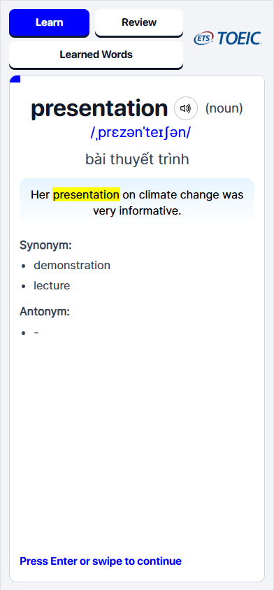
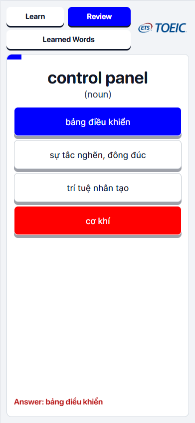
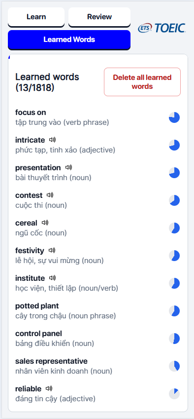

# ENGVOCVN

ENGVOCVN is a TOEIC-focused English vocabulary web app built for **long-term retention**, not short-term memorization.  
It combines spaced repetition, mixed quiz formats, and instant mistake recovery so learners can keep improving across sessions.

## Live Demo

Try it on GitHub Pages: **https://thanhdat7d2.github.io/engvocvn/**

## Demo Screenshots

### 1) Learn Word Definition



### 2) Review Session



### 3) Learned Words List



## Why This App

Many vocabulary tools help users _recognize_ words once, but not _retain_ them over time.
ENGVOCVN addresses this by:

- Prioritizing words that are most urgent to review.
- Rotating practice types to reduce pattern memorization.
- Re-exposing weak words immediately after mistakes.
- Persisting progress in the browser so learning continues naturally day to day.

## Core Features

### Learning + Review Flow

- **Continuous SRS stream**: the app runs as a continuous learning/review pipeline.
- **Learn mode**: introduces new words while also injecting due review cards.
- **Review mode**: focuses only on words that were already introduced.
- **Chunked sessions**: a 50-card session is treated as a progress unit, not a hard reset.

### Rich Practice Types

ENGVOCVN supports multiple review styles to strengthen recall from different angles:

1. Meaning → Word (multiple choice)
2. Meaning → Word (typing)
3. Word → Meaning (multiple choice)
4. Example → Meaning (multiple choice)
5. Audio → Meaning (multiple choice)
6. Synonym / Antonym (multiple choice)

### Smart Scheduling Behavior

- **Urgency-first selection** chooses what to review next.
- **Balanced type selection** prefers unseen or least-used quiz types.
- **Anti-repeat logic** avoids repetitive review patterns.
- **Immediate recovery**: wrong answers queue a definition card for the same word.

### Progress Tracking

- Dedicated **Learned Words** panel to inspect learned vocabulary.
- Per-word learning state stores values such as:
  - `stability`
  - `counter`
  - `distance`
  - `grow_rate`
  - `urgency`
  - `mastery_score`
  - `RTcounter`
  - error history queue
- Pronunciation replay when audio sources are available.

## Tech Stack

- **Frontend**: HTML, CSS, Vanilla JavaScript
- **Data**: static JSON (`data/data.json`)
- **Persistence**: browser `localStorage`
- **Deployment**: static hosting (GitHub Pages ready)

## Project Structure

```text
.
├─ index.html
├─ README.md
├─ audio/
├─ data/
│  └─ data.json
├─ demo/
├─ font/
├─ icon/
├─ script/
│  ├─ app.js
│  ├─ reviewEngine.js
│  ├─ scheduler.js
│  ├─ sessionBuilder.js
│  ├─ storage.js
│  └─ wordState.js
└─ style/
   └─ app.css
```

## Run Locally (Quick)

Use any local static server (required for JSON/modules).

```bash
python -m http.server 5500
```

Open: **http://localhost:5500**

## Notes

- Vocabulary data is based on the ETS word list (2026), especially for TOEIC preparation.
- Audio playback depends on available pronunciation links in your dataset.
- Use **Delete all learned words** in-app to reset local progress.

## Author

**Nguyễn Thành Đạt**  
GitHub: [thanhdat7d2](https://github.com/thanhdat7d2)
